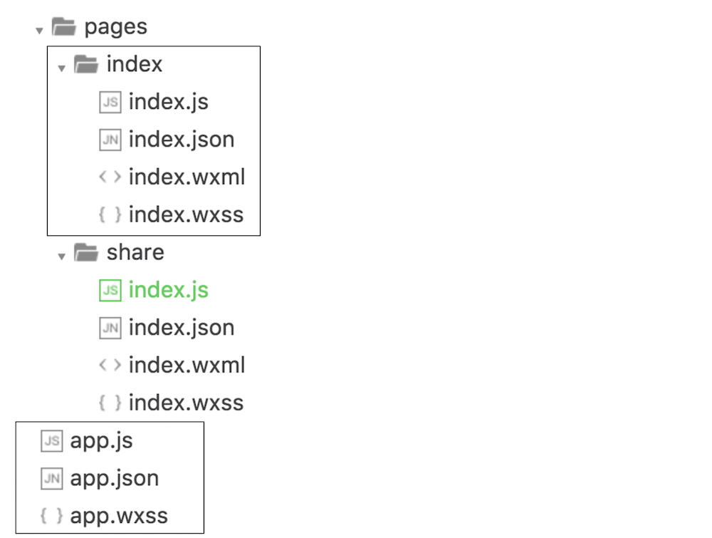
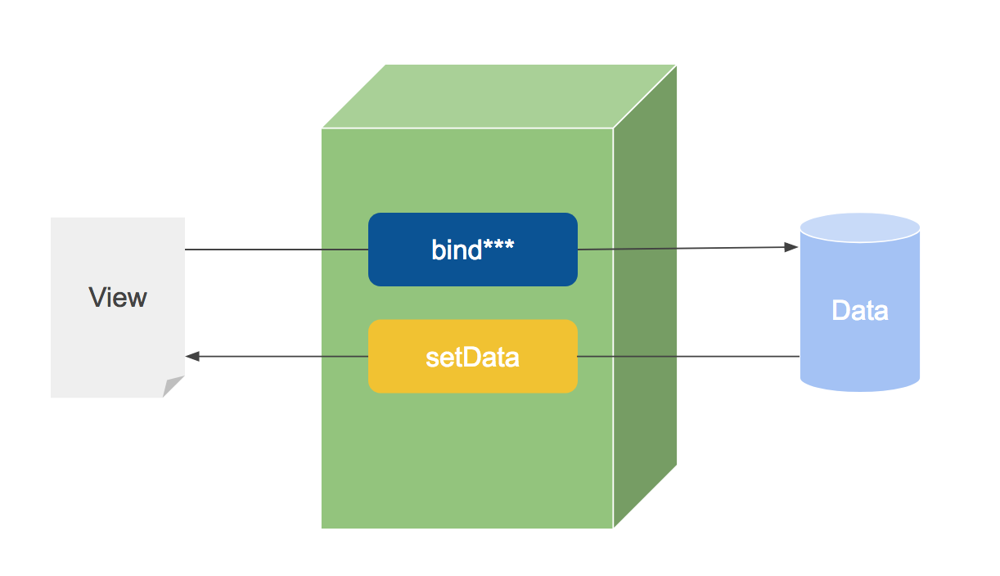

<!-- $theme: default -->

# 30 分钟精通微信小程序

## SToneX @ Frontend Team

---

# 当我们谈小程序时，我们是指什么？

---

> 小程序是一种新的开放能力，开发者可以快速地开发一个小程序。小程序可以在微信内被便捷地获取和传播，同时具有出色的使用体验。

---

# 什么是微信小程序 ?

* 开发
  - 平台
  - Web 框架 MINA
  - Native API
  - IDE
* 运营
* 社区
* 设计

---

# 平台

- 从零到上线（注册，审核，...）
- 数据分析
- [入口](https://mp.weixin.qq.com/debug/wxadoc/dev/framework/app-service/scene.html)

---

# First Step

## DEMO: 初始化项目

---

# [Native](https://mp.weixin.qq.com/debug/wxadoc/dev/api/)

- 网络
- 媒体
- 文件
- 数据缓存
- 位置
- 设备
- 其他开放接口（微信登陆，数据）

---

# DEMO

```javascript
wx.vibrateShort({
  success: () => { /* 震动成功 */ },
  fail: () => { /* 震动失败 */ },
  complete: () => { /* 调用结束 */ },
})
```
---

# 框架



---

# WXML

```jsx
<!--wxml-->
<view> {{message}} </view>

// page.js
Page({
  data: {
    message: 'Hello MINA!'
  }
})
```

---

# WXML

###  for

```
<view wx:for="{{array}}"> {{item}} </view>

data: {
  array: [1, 2, 3, 4, 5]
}
```

### if

```
<view wx:if="{{view == 'WEBVIEW'}}"> WEBVIEW </view>
<view wx:elif="{{view == 'APP'}}"> APP </view>
<view wx:else="{{view == 'MINA'}}"> MINA </view>

data: {
  view: 'MINA'
}
```

---

# WXSS

> WXSS is CSS
---

# WXSS

* rpx（responsive pixel）: 可以根据屏幕宽度进行自适应。规定屏幕宽为750rpx。如在 iPhone6 上，屏幕宽度为375px，共有750个物理像素，则750rpx = 375px = 750物理像素，1rpx = 0.5px = 1物理像素。

---

# WXSS

```js
<view style="color:{{color}};" />

data: {
  view: 'red'
}
```

---

# 框架

### MVVM



---

## DEMO: 双向绑定

```jsx
<!--wxml-->
<view> {{message}} </view>
<input value="{{message}}" bindinput="bindInput" />

// page.js
Page({
  data: {
    message: 'Hello MINA!'
  },
  bindInput(e) {
    this.setData({ message: e.detail.value })
  }
})
```

---

# 框架

### 组件

* view
* scroll-view
* text
* button


* switch
* map


* contact-button

---

# DEMO

---

# 优势

* 高度封装
* 性能
* 数据分析
* 文档和社区

---

# 劣势

* 高度封装
* 灵活性
* 兼容性
* 漏洞
* 审核
* 文档和社区

---
> https://github.com/stonexer/share_wx

---


